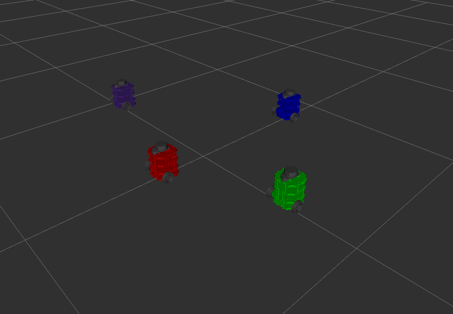

# Nuturtle  Description
URDF files for Nuturtle Fatima
* `ros2 launch nuturtle_description load_one.launch.py` to see the robot in rviz.
* `ros2 launch nuturtle_description load_all.launch.xml` to see four copies of the robot in rviz.

* The rqt_graph when all four robots are visualized (Nodes Only, Hide Debug) is:

# Launch File Details
* `ros2 launch nuturtle_description load_one.launch.py --show-args`
  
  `Arguments (pass arguments as '<name>:=<value>'):

    'color':
        Color choice for the turtle bot. purple by default. Valid choices are: ['red', 'blue', 'purple', 'green']
        (default: 'purple')

    'use_jsp':
        Choose whether to use the joint state publisher or not(true/false).         true by default. Valid choices are: ['true', 'false']
        (default: 'true')

    'use_rviz':
        Choose whether to use rviz or not (true/false).         true by default. Valid choices are: ['true', 'false']
        (default: 'true')
`
* `ros2 launch nuturtle_description load_all.launch.xml --show-args`
  `Arguments (pass arguments as '<name>:=<value>'):

    'color':
        Color choice for the turtle bot. purple by default. Valid choices are: ['red', 'blue', 'purple', 'green']
        (default: 'purple')

    'use_jsp':
        Choose whether to use the joint state publisher or not(true/false).         true by default. Valid choices are: ['true', 'false']
        (default: 'true')

    'use_rviz':
        Choose whether to use rviz or not (true/false).         true by default. Valid choices are: ['true', 'false']
        (default: 'true')`